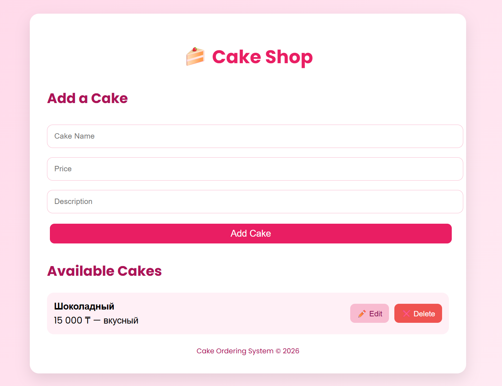
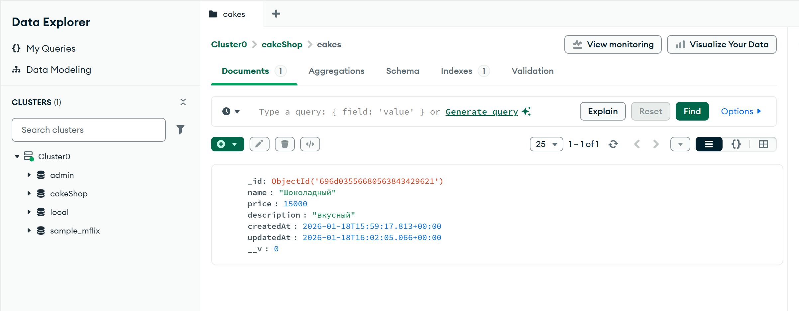

# Cake Ordering System

This project is a **full-stack Cake Ordering System** built with **Node.js, Express, MongoDB Atlas, and a simple HTML/JavaScript frontend**. It allows users to manage cake orders with full **CRUD functionality**: create, read, update, and delete cakes.

## Project Overview

The main objective of this project was to evolve a local JSON-based backend into a fully functional system with **persistent data storage** in MongoDB. The primary object is a **Cake**, which includes the following fields:

- **Name** (string, required)
- **Price** (number, required)
- **Description** (string, required)
- **Timestamps** (`createdAt` and `updatedAt`) to track creation and updates

All fields are validated on the backend to ensure proper data integrity.

## Backend

The backend is implemented with **Node.js and Express**, using **Mongoose** to connect and interact with a **MongoDB Atlas database**. The following RESTful API endpoints are implemented:

- **POST /api/cakes** – Create a new cake (returns **201 Created**)
- **GET /api/cakes** – Retrieve all cakes (returns **200 OK**)
- **GET /api/cakes/:id** – Retrieve a specific cake by ID (returns **200 OK** or **404 Not Found**)
- **PUT /api/cakes/:id** – Update a cake by ID (returns **200 OK** or **400 Bad Request**)
- **DELETE /api/cakes/:id** – Delete a cake by ID (returns **200 OK**)

All endpoints were manually tested using **Postman** to ensure correct behavior and proper interaction with MongoDB.

## Frontend

The frontend is a **simple and clean HTML/JavaScript interface** that allows users to:

- Add new cakes with **Name, Price (₸), and Description**
- View all existing cakes, displaying their price formatted in **Kazakhstani Tenge (₸)**
- Edit cakes directly via an **Edit button**
- Delete cakes via a **Delete button**

The design features a **pink gradient background**, rounded cards for each cake, and modern fonts for a professional appearance.

## Features

- Full **CRUD functionality** with MongoDB persistence
- Proper **HTTP status codes** for all operations
- Frontend displays prices in **₸** with formatted numbers
- Easy to extend for additional features like reviews or user management

## Screenshots

**1. Frontend Interface – Cake Shop:**  

**2. MongoDB Atlas – Stored Cake Data:**  

